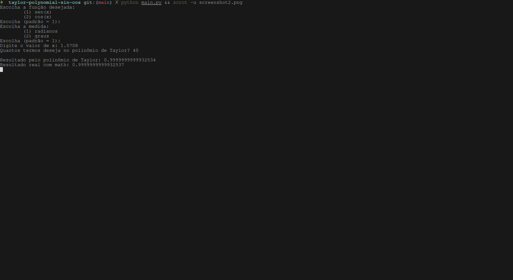

# Série de Taylor: seno e cosseno

Programa em Python que calcula **sen(x)** e **cos(x)** aproximando-os pela **série de Taylor**, comparando o resultado com `math.sin`/`math.cos`.

$$
\sin(x) = \sum_{i=0}^{\infty} \frac{(-1)^i \cdot x^{2i+1}}{(2i+1)!}
\qquad
\cos(x) = \sum_{i=0}^{\infty} \frac{(-1)^i \cdot x^{2i}}{(2i)!}
$$

## Funcionalidades

- Escolha entre `sen(x)` ou `cos(x)`
- Entrada em **radianos** ou **graus**
- Mostra o valor aproximado, o valor da biblioteca e a diferença (erro)

## Executando

```bash
python3 main.py
```

## Screenshots

  
